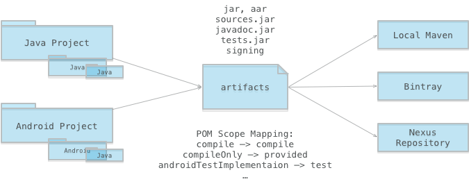

# Publications



Gradle scripts/plugin that helps to publish jar/aar artifacts with gradle `maven` or `maven-publish` plugin.

This repository contains two components: scripts and plugin.

The scripts work just like [chrisbanes/gradle-mvn-push](https://github.com/chrisbanes/gradle-mvn-push) but suport with both `maven` and `maven-publish`, as well as more customization with `pom.xml`. The plugin is going to be a custom gradle plugin which make the workflow much simplier.

## Project Structure

| Demo projects   | Description                   |
| :-------------- | :---------------------------- |
| app             | Demo app module               |
| lib-android     | Demo android library module   |
| lib-android-sub | Demo android library module 2 |
| lib-java        | Demo java library module      |
| lib-java-sub    | Demo java library module  2   |

| Script                        | Description                                                    |
| :---------------------------- | :------------------------------------------------------------- |
| gradle/maven.gradle           | Workaround script with gradle plugin 'maven'                   |
| gradle/maven-dcendents.gradle | Workaround script with 3rd-party gradle plugin 'android-maven' |
| gradle/maven-publish.gradle   | Workaround script with gradle plugin 'maven-publish'           |

| Plugin                    | Description                                                        |
| :------------------------ | :----------------------------------------------------------------- |
| gradle-plugin/publication | Custom gradle plugin that helps to publish jar/aar artifacts (WIP) |

## Getting Started

### Script

1. Config the properties required by the script.
2. Apply the script file on demand in 'build.gradle'.
3. Run the script tasks to publish artifacts to local/remote repository.

Config the project properties like:

```shell
# required: must be configurated
# required here or system env: must be configurated in project properties or system environment

# ----------
# Maven repository config
# ----------
RELEASE_REPOSITORY_URL=(required here or system env)
SNAPSHOT_REPOSITORY_URL=(required here or system env)

NEXUS_USERNAME=(required here or system env)
NEXUS_PASSWORD=(required here or system env)

POM_URL=https://github.com/kaedea/publication/
POM_SCM_URL=https://github.com/kaedea/publication/
POM_SCM_CONNECTION=scm:git:git://github.com/kaedea/publication.git
POM_SCM_DEV_CONNECTION=scm:git:ssh://git@github.com:kaedea/publication.git

POM_LICENCE_NAME=The Apache Software License, Version 2.0
POM_LICENCE_URL=http://www.apache.org/licenses/LICENSE-2.0.txt
POM_LICENCE_DIST=repo

POM_DEVELOPER_ID=kaedea
POM_DEVELOPER_NAME=Kaede Akatsuki

# ----------
# Maven artifact config
# ----------
GROUP=com.kaedea (required)
VERSION_NAME=0.1.0-SNAPSHOT (required)
VERSION_CODE=10

POM_NAME=Publication Android Library
POM_ARTIFACT_ID=publication-android-library
POM_PACKAGING=jar|aar
POM_DESCRIPTION=Demo android library of project Publications
```

Apply the script in your project's build.gradle:

```groovy
// We have 2 ways to apply the script:
// 1. apply from remote url
// 2. apply from scirpt file from 'project/gradle/..'

// For leagcy 'maven' plugin:
apply from: 'http://kaedea.github.com/publication/gradle/maven.gradle'

// For dcendents's 'android-maven' plugin:
apply from: 'http://kaedea.github.com/publication/gradle/maven-dcendents.gradle'

// For new 'maven-publish' plugin:
apply from: 'http://kaedea.github.com/publication/gradle/maven-publish.gradle'
```

At last, run the following tasks to publish:

```bash
# For leagcy 'maven' or dcendents's 'android-maven' plugin:
gradle :uploadArchives

# For new 'maven-publish' plugin:
gradle :generatePomFileForArchivesPublication
gradle :publishToMavenLocal
gradle :publish
```

### Upload to Bintray

Apply the bintray script to upload the artifacts to Bintray/JCenter (additional).

Config the project properties like:

```shell
# ----------
# Bintray auth config
# ----------
BINTRAY_USERNAME=(required here or system env)
BINTRAY_API_KEY=(required here or system env)

# ----------
# Maven repo config
# ----------
BINTRAY_REPO=maven
BINTRAY_NAME=publication-android
```

Apply the script in your project's build.gradle as [Script](#Script) above, then apply the bintray script:

```groovy
apply from: 'http://kaedea.github.com/publication/gradle/bintray.gradle'
```

Run the following tasks to publish to Bintray:

```bash
gradle :bintrayUpload
```

### Plugin

Work in progress

## References

1. [https://docs.gradle.org/current/userguide/maven_plugin.html](https://docs.gradle.org/current/userguide/maven_plugin.html)
1. [https://docs.gradle.org/current/userguide/publishing_maven.html](https://docs.gradle.org/current/userguide/publishing_maven.html)
1. [https://github.com/square/picasso/blob/master/gradle/gradle-mvn-push.gradle](https://github.com/square/picasso/blob/master/gradle/gradle-mvn-push.gradle)
1. [https://github.com/dcendents/android-maven-gradle-plugin](https://github.com/dcendents/android-maven-gradle-plugin)
1. [https://stackoverflow.com/questions/26874498/maven-publish-android-library-with-aar-and-source-jar](https://stackoverflow.com/questions/26874498/maven-publish-android-library-with-aar-and-source-jar)

## License

The project is [Apache License, Version 2.0](/LICENSE) licensed.